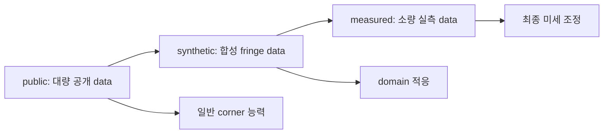
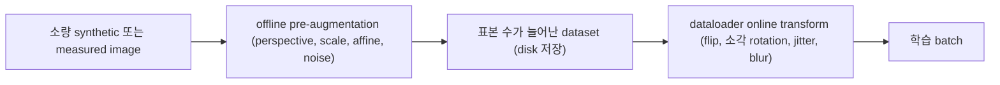

# Data Strategy

이 문서는 현재 project가 학습 data를 public, synthetic, measured 세 단계로 구성하는 이유와, 각 단계의
data 특성이 어떻게 project 전체의 설계 제약이 되는지 설명한다. CSV schema, split, transform 같은 실무
절차는 [Dataset Format Guide](../guides/01-dataset-format.md)에서 다루며, 이 문서는 그 앞 단계에서 data가
어떤 성질을 가지고 왜 이런 순서로 사용되는지를 architecture 관점에서 설명한다.

model마다 raw output과 postprocess는 다르지만, 학습 이전 단계의 원재료는 모두 동일하다. 한 장의 RGB
image와 그 안의 quadrilateral ROI를 나타내는 표준 순서 corner 네 점이다. 따라서 data 품질과 다양성은
특정 model 하나가 아니라 11개 model 전체의 성능 상한을 함께 결정한다.

## 1. 공통 원재료와 표준 계약

모든 model이 공유하는 data 계약은 [Model Contract](01-model-contract.md)와 같다. image는 `(B, 3, H, W)`
tensor이고, target corner는 `(B, 4, 2)` 형태로 `TL`, `TR`, `BR`, `BL` 순서를 가지며 좌표는 `[0, 1]`
normalized 값이다. 이 순서와 normalize 규약은 data source가 public이든 synthetic이든 measured이든
동일하게 유지된다.

corner를 이 표준 순서로 확보하는 방법은 data source에 따라 다르다. 4점 polygon으로 주어지면 순서만
정규화하고, binary mask로 주어지면 극점 추출로 네 점을 복원한 뒤 순서를 정규화한다. 표준 순서 복원
절차의 수식은 [Dataset Format Guide](../guides/01-dataset-format.md)의 corner 순서 절과 연결된다. 핵심은
어떤 source에서 왔든 학습에 들어가는 순간에는 동일한 `(4, 2)` 계약을 만족한다는 점이다.

## 2. 3단계 data 전략

measured data가 소량인 상황에서 model을 measured data만으로 처음부터 학습하면, 표본 수에 비해 model
용량이 커서 overfitting 위험이 크다. 이 문제의 표준 해법이 transfer learning이며, 일반 능력을 대량
data로 먼저 학습하고 목표 domain에 가까운 data로 점진적으로 적응시킨다. 현재 project는 이를 세 단계로
구성한다.

세 단계의 목적과 data는 다음과 같다.

| 단계 | logical stage | data | 목적 |
| --- | --- | --- | --- |
| 1 | `public` | 공개 문서, 카드 corner detection dataset | 임의의 사각형 물체에서 corner 네 개를 찾는 일반 능력 학습 |
| 2 | `synthetic` | 합성 fringe pattern image | 검사 domain의 fringe texture에 적응 |
| 3 | `measured` | 실제 장비 촬영 소량 data | 최종 목표 data에 미세 조정 |

세 단계를 거치며 learning rate를 단계마다 한 자릿수씩 줄이는 것이 일반적인 설계 원칙이다. 1단계에서
학습된 parameter는 이미 corner를 찾는 일반 능력을 담고 있으므로, 이후 단계에서 큰 learning rate를
그대로 쓰면 소량이고 편향된 data의 noise가 이 능력을 크게 훼손할 수 있다. learning rate를 줄이면
갱신 폭이 좁아져 기존 능력 근방에서 목표 domain에 맞는 미세 조정만 일어나도록 유도한다.

현재 CLI의 `--dataset`은 이 세 단계의 logical stage 이름과 같다. `--dataset`은 output path의 논리
구분자로 쓰이며 `outputs/<dataset>/<model>/<network_head>/<exp_name>/` 경로의 첫 segment가 된다. 즉
data 전략의 단계 이름이 실험 산출물 경로에 그대로 남는다. `--dataset` 자체가 특정 CSV를 자동으로
선택하지는 않으며, 실제 data는 `--csv_path`로 지정한다.

## 3. 단계별 data 특성

각 단계는 서로 다른 data 특성을 가진다. 이 특성 차이가 이후 4절의 제약으로 이어진다.

public 단계는 표본 수가 많고 물체 종류가 다양하지만 검사 domain의 fringe texture와는 거리가 있다.
따라서 corner를 찾는 일반 능력을 학습하기에는 적합하지만, 이 단계만으로는 목표 domain 성능을 보장하지
못한다.

synthetic 단계는 fringe pattern을 수식으로 생성하므로 표본을 대량으로 만들 수 있고, 생성에 사용한
변환 parameter로부터 corner 좌표를 오차 없이 자동으로 얻는다. 그러나 합성 image와 실측 image 사이에는
domain gap이 존재하므로, 다중 위상과 다중 주파수를 섞어 실측 분포에 가깝게 만든다.

measured 단계는 목표 data와 정확히 같은 분포를 가지지만 표본이 소량이다. 따라서 이 단계는 처음부터
학습하는 대상이 아니라 앞 두 단계에서 학습된 parameter를 미세 조정하는 대상이다.

## 4. Data 특성이 만드는 project 제약

data 특성은 이 project의 설계 제약으로 이어진다. 제약은 F1부터 F8까지 부여하며, 각 제약이 data 준비와
model 설계에 미치는 영향은 다음과 같다.

| 제약 | 내용 | 주요 영향 |
| --- | --- | --- |
| F1 | ROI는 임의의 볼록 사각형이며 축 정렬 box가 아니다 | quad를 box로 근사하는 접근을 배제하고 corner 표현을 요구한다 |
| F2 | 단일 객체가 image의 절반 이상을 차지한다 | 별도 ROI 검출 stage가 필요 없고 corner 간 거리가 충분하다 |
| F3 | 네 corner는 항상 image 경계 내부에 있다 | 회전 augmentation 범위를 좁게 제한하고 clipping 검증을 요구한다 |
| F4 | measured data는 소량이고 synthetic data는 대량이다 | 2절의 3단계 전략과 합성 data 생성의 직접 근거다 |
| F5 | subpixel 정밀도가 필요하다 | 좌표 기반 label과 합성 자동 label로 양자화 오차를 피한다 |
| F6 | 배포 지연과 model 크기에 예산 제약이 있다 | 경량 model과 backbone 선택, latency 측정을 요구한다 |
| F7 | 조명, glare, vignetting이 변동한다 | 광학 augmentation과 다중 위상 합성 pattern을 요구한다 |
| F8 | 패널 가림이 없다 | 단일 contour 가정과 class별 단일 detection 가정을 허용한다 |

이 제약들은 서로 얽혀 있다. 예를 들어 F2와 F3이 함께 작용하면 회전이나 원근 왜곡이 조금만 커져도
corner 하나가 image 경계 밖으로 밀려날 수 있으므로, 모든 기하학적 augmentation은 image와 좌표를 함께
변환한 뒤 좌표가 경계를 벗어나면 그 augmentation을 적용하지 않는 방식으로 F3을 지킨다.

## 5. 합성 data 자동 레이블 원리

synthetic 단계의 가장 큰 이점은 label을 사람이 그릴 필요가 없다는 점이다. fringe pattern은 다음
sinusoidal 모델로 근사한다.

$$
I(x, y) = A + B \cos\big(2\pi f (x \cos\theta + y \sin\theta) + \phi\big)
$$

여기서 $A$는 배경 밝기, $B$는 대비, $f$는 공간 주파수, $\theta$는 pattern 방향, $\phi$는 위상
offset이다. 이 sinusoidal fringe 모델과 완만한 곡률, 불균일한 밝기 같은 시각적 특징은 phase measuring
deflectometry(PMD) 참고 자료의 반사면 fringe 관찰에 근거한다. 실제 계측 환경은 여러 위상을 순차
촬영하는 N-step phase-shifting을 사용하므로, 위상 offset을 등간격 값 중에서 무작위로 고르면 학습 data가
실제 다채널 위상 편이 분포와 통계적으로 유사해진다. 서로 다른 주파수 성분을 중첩하면 저주파와 고주파가
함께 존재해 합성과 실측 사이의 domain gap이 좁아진다.

자동 label은 원근 변환에서 나온다. 정규화 단위 정사각형 $[0, 1]^2$ 위에 pattern을 그리면 네 꼭짓점은
항상 $(0, 0)$, $(1, 0)$, $(1, 1)$, $(0, 1)$로 알려져 있다. 이 캔버스에 임의의 homography $H$를 적용해
비스듬히 촬영한 것과 같은 image를 만들면, 변환된 image의 corner는 원래 꼭짓점을 같은 homography로
투영한 결과와 정확히 일치한다.

$$
\mathbf{c}_k' = \pi(H, \mathbf{c}_k), \qquad k = 1, 2, 3, 4
$$

따라서 corner label은 별도로 측정하거나 추정할 필요 없이 image 생성에 사용한 homography parameter에서
정확히 계산된다. 이는 mask 기반 추출의 양자화 오차와 달리 연속 좌표를 그대로 보존하므로 F5 제약과
부합한다.

## 6. synthetic 합성 변형 변수

5절의 자동 레이블 원리는 하나의 fringe panel을 만드는 방법을 설명한다. 실제 synthetic dataset은 이
생성기에 여러 변형 변수를 조합해 서로 다른 표본을 대량으로 만든다. 각 변수는 독립적으로 표본 분포를
넓히는 축이며, 사용자는 필요에 따라 변수 계열별 변형 개수를 차별 적용한다. measured 분포에서 자주
나타나는 변형은 개수를 늘리고 거의 나타나지 않는 변형은 줄여, 합성 표본 분포를 실측 분포에 가깝게
맞추는 것이 목적이다.

주요 변형 변수 계열과 범위는 다음과 같다. 범위 값은 개념 baseline이며 실제 생성 script에서 조정할 수
있다.

| 변수 계열 | 주요 옵션과 범위 | 실측에서의 의미 |
| --- | --- | --- |
| 위치와 자세 | rotation `$-10$`부터 `$+10$`도, 수평 이동 `$\pm 8\%$`, 수직 이동 `$\pm 2.5\%$`, top-bottom 비율 0.84부터 0.98의 trapezoid, panel 크기 image의 약 80% | 촬영 위치와 카메라 시점 변동 |
| corner 라운딩 | 짧은 변 대비 반지름 3%부터 8%, 직사각형과 정사각형 panel | 패널 모서리 가공 형태 |
| 외부 지그 | 배치 left-right, top-bottom, four sides, 변당 개수 1부터 3, 길이 6%부터 20%, 깊이 3%부터 12%, 밝기 0.06부터 0.50 | 고정 지그가 panel 경계를 부분적으로 가리는 상황 |
| 카메라 hole | 위치 top-center, upper-left, 지름 3%부터 6%, 가시성 visible, partial, hidden | 패널 위 카메라 구멍의 위치와 노출 |
| 배경 밝기 | 평균 0.03부터 0.90의 dark, medium, bright bin, 조명 gradient, vignetting 0%부터 25%, noise 1부터 8 gray | 조명과 vignetting 변동 (F7) |
| fringe 왜곡 | 주파수 8부터 36 cycle, 위상 `$\{0, \pi/2, \pi, 3\pi/2\}$`, 방향 vertical과 horizontal, global bow deformation | phase-shifting과 표면 곡률에 따른 fringe 변형 |

각 변수 계열의 실제 합성 예시는 slide 자산에 있다. 모든 예시에서 정답 corner 네 점이 함께 표시되며
합성 parameter에서 오차 없이 얻어진다. 예시 이미지 파일은 다음과 같다.

| 변수 계열 | 예시 이미지 |
| --- | --- |
| 위치와 자세 | `slides/assets/synth_position.png` |
| corner 라운딩 | `slides/assets/synth_rounding.png` |
| 외부 지그 | `slides/assets/synth_holder.png` |
| 카메라 hole | `slides/assets/synth_camera_hole.png` |
| 배경 밝기 | `slides/assets/synth_background.png` |
| fringe 왜곡 | `slides/assets/synth_fringe.png` |

이 예시 이미지는 도식이 아니라 변형 변수를 실제 값으로 설정해 그린 합성 결과다. 재생성 방법은
`slides/README.md`에 정리되어 있다. 변수별 변형 개수를 차별 적용하는 방식은 7절의 offline
pre-augmentation과 결합해 최종 표본 수와 분포를 결정한다.

각 변수 계열의 파라미터 범위, 카메라 hole 가시성 제어, corner 레이블 정의, LabelMe JSON 규격, 생성
파이프라인과 실행 방법 같은 실무 절차는 [Synthetic Generation Guide](../guides/05-synthetic-generation.md)에서
다룬다.

## 7. Offline pre-augmentation과 online transform

synthetic과 measured image는 실제 표본 수가 적다. 5절의 합성 생성기는 fringe pattern과 다양한 distortion
을 적용해 표본 자체를 만들지만, 생성된 표본 수가 여전히 부족하면 학습 전에 offline pre-augmentation으로
표본 수를 미리 늘린다. offline pre-augmentation은 원본 image와 corner에 강한 기하학적, 광학적 변형을
적용해 새로운 image와 label 쌍을 만들고 disk에 저장하는 단계다. 결과적으로 dataset의 표본 수가 실제로
증가한다.

이 단계는 dataloader가 학습 중 적용하는 online transform과 목적과 성격이 다르다. 두 단계의 차이는 다음과
같다.

| 항목 | offline pre-augmentation | online transform |
| --- | --- | --- |
| 실행 시점 | 학습 전 1회 | 학습 중 매 epoch |
| 표본 수 | 실제로 증가 | 변하지 않음 |
| 저장 | 새 image와 label을 disk에 저장 | 저장하지 않고 batch에서 소비 |
| 변형 강도 | perspective, scale, affine, noise를 포함한 강한 distortion | 단순 flip, 소각 rotation, 광학 jitter |
| 목적 | 소량 data의 표본 수 확보 | 매 epoch 다양성 추가 |

현재 `src/data/transforms.py`에는 두 성격의 transform이 모두 있다. `RandomPerspective`, `RandomScale`,
`RandomAffine`, `GaussianNoise`는 image와 corner를 함께 변환하고 좌표가 `[0, 1]`을 벗어나면 그 변형을
건너뛰는 clipping 검증을 포함한 distortion 계열이다. 이들은 소량 data를 offline으로 확장할 때 사용할 수
있다. 반면 현재 active `get_transform`은 train split에 `RandomHorizontalFlip`, `RandomVerticalFlip`,
`RandomRotation` 소각, `ColorJitter`, `GaussianBlur`만 online으로 적용하며, 표본 수를 늘리지 않는다.

두 계열 transform을 합성 fringe panel에 실제로 적용한 예시는 slide 자산 `slides/assets/transform_offline.png`
와 `slides/assets/transform_online.png`에 있다. 두 이미지는 도식이 아니라 `src/data/transforms.py`의
transform class를 직접 적용한 before/after 결과이며 corner가 image와 함께 변환된다. 재생성 방법은
`slides/README.md`에 정리되어 있다.

두 단계를 구분하는 이유는 역할이 다르기 때문이다. offline pre-augmentation은 부족한 표본 수 자체를
늘려 overfitting을 완화하고, online transform은 이미 확보된 표본에 매 epoch 변화를 더해 같은 image가
반복 학습되는 것을 막는다. 어느 단계에서든 기하학적 변형은 image와 corner를 함께 변환하고 좌표가
경계를 벗어나면 그 변형을 적용하지 않는 F3 clipping 원칙을 동일하게 지킨다. 현재 공통 CLI는 online
transform만 자동으로 실행하며, offline pre-augmentation을 자동화한 별도 script는 현재 범위 밖이다.

## 8. Data 전략과 model 표현의 관계

data 전략은 model 표현 선택과도 연결된다. F1은 corner 표현 자체를 요구하므로 `reg`, `seg`, `peak`,
`ridge`, `det`, `gcn`, `hybrid`가 모두 최종적으로 표준 corner를 만든다. F4는 data 요구가 큰 표현일수록
synthetic 단계 의존이 커진다는 것을 의미하며, F5는 subpixel 정밀도가 필요한 표현에서 dense map과
geometry 후처리가 유리할 수 있음을 시사한다.

data 특성과 model 표현의 연결은 다음과 같이 요약한다.

| data 특성 | 관련 제약 | model 표현에 대한 함의 |
| --- | --- | --- |
| 단일 큰 볼록 사각형 | F1, F2 | corner 표현 필요, 별도 검출 stage 불필요 |
| 소량 measured, 대량 synthetic | F4 | data 요구가 큰 표현은 synthetic 단계 의존이 큼 |
| subpixel 정밀도 | F5 | 좌표와 dense map 표현이 양자화 오차에 유리 |
| 조명과 texture 변동 | F7 | 광학 augmentation과 다중 위상 합성이 강건성 확보 |

표현이 복잡할수록 항상 유리한 것은 아니다. dense map과 mask는 spatial evidence를 풍부하게 사용하지만
target 생성과 postprocess가 추가되고, 좌표를 바로 회귀하는 방식은 단순하지만 작은 local structure를
하나의 vector로 압축해야 한다. 이 절충은 [Model Guide](../models/README.md)에서 자세히 다룬다.

## 9. 현재 구현 범위

data 전략의 개념과 현재 구현 상태를 구분한다. 현재 구현은 labeled CSV를 읽어 단일 dataset에서 seed
기반으로 split을 만들고, train split에 기하학적, 광학적 augmentation을 적용한다. `--dataset`은 output
path의 logical stage 이름으로 사용되며 3단계 학습을 자동으로 orchestrate하는 별도 pipeline은 현재
공통 CLI에 포함되지 않는다.

현재 지원 여부는 다음과 같이 구분한다.

- 단계 이름 `public`, `synthetic`, `measured`는 `--dataset` 값과 output path에 사용된다.
- 실제 data source는 `--csv_path`로 지정하며 `--dataset`이 CSV를 자동 선택하지 않는다.
- 합성 fringe 생성과 단계별 learning rate 스케줄은 개념 설계이며, 자동화된 3단계 orchestration script는
  현재 공통 CLI 범위 밖이다.
- online transform은 `get_transform`이 train split에 자동으로 적용하지만, offline pre-augmentation을
  자동화한 별도 script는 현재 범위 밖이다. `transforms.py`의 distortion 계열 class는 제공되며 offline
  확장에 사용할 수 있다.

따라서 이 문서의 3단계 전략과 제약은 project 설계 근거를 설명하는 architecture baseline이며, 개별 단계의
data 준비와 실행은 [Dataset Format Guide](../guides/01-dataset-format.md)와 [CLI Usage](../guides/02-cli-usage.md)의
현재 지원 option을 따른다.

## 10. 핵심 요약

data는 public, synthetic, measured 세 단계로 사용하며, 이는 measured data 부족을 transfer learning으로
보완하기 위한 구성이다. public은 일반 corner 능력을, synthetic은 domain 적응을, measured는 최종 미세
조정을 담당하고, 단계가 진행될수록 data 양과 learning rate가 함께 줄어든다. 세 단계의 data 특성은 F1부터
F8까지의 제약으로 이어져 augmentation 범위, 표현 선택, 평가 기준을 결정한다. 합성 data는 homography로
corner label을 오차 없이 자동 생성해 subpixel 제약과 부합한다. synthetic과 measured image가 소량이므로
학습 전에 offline pre-augmentation으로 표본 수를 늘리며, 이는 dataloader의 단순 online transform과
목적과 강도가 다르다. 현재 구현은 이 전략의 단계 이름을 `--dataset` logical stage로 사용하고 online
transform만 자동 실행하며, 자동화된 3단계 orchestration과 offline pre-augmentation script는 현재 공통
CLI 범위 밖이다.
