# 진행 보고 슬라이드 초안

이 문서는 roi-corner-detection-ver3 진행 보고 슬라이드의 페이지별 초안이다. 각 페이지는 pptx 한 장에
대응한다. 블록 다이어그램은 mermaid로 표시하고 후처리 결과는 이미지로 삽입한다. 모든 model은
독립된 한 페이지를 가지며 데이터, 전처리, 모델 내부 변환, 후처리, 손실함수를 하나의 흐름으로 그린다.

이 초안의 model 페이지는 공통 골격을 따른다. 상단에 한 문장 요약을 두고, 중앙에 `데이터 -> 전처리 ->
모델 -> 후처리 -> 손실함수` 블록 다이어그램을 두며, 하단에 후처리 시각화 이미지와 핵심 표를 둔다.

## 페이지 1. 표지

제목은 ROI Corner Detection ver3 진행 보고다. 부제로 하나의 corner contract로 11개 neural network
표현을 학습, 평가, 비교하는 PyTorch workspace임을 적는다. 작성일과 작성자, 발표 범위를 함께 둔다.

발표에서 다루는 범위는 다음과 같다.

- 프로젝트 개요와 공통 문제 정의
- 데이터에서 예측까지의 워크플로우
- 11개 model의 표현과 내부 조립
- 외부 whole-model 래퍼 구조
- 평가 지표와 결과 비교 프레임
- 최적 model 선정 기준과 현재 상태

## 페이지 2. 프로젝트 개요

입력은 RGB image이고 출력은 quadrilateral ROI의 네 corner다. 모든 model이 같은 tensor 계약을 공유한다.

| 항목 | shape | 값과 순서 |
| --- | --- | --- |
| image batch | `(B, 3, H, W)` | ImageNet normalize RGB tensor |
| target corner | `(B, 4, 2)` | `[0,1]`, `TL`, `TR`, `BR`, `BL` |
| final prediction | `(B, 4, 2)` | postprocess 이후 normalized ordered corner |

기본 입력은 `224 x 224`다. 좌표는 pixel index가 아니라 width와 height에 대한 비율이므로 `(0.25, 0.5)`는
왼쪽에서 25%, 위에서 50% 위치를 뜻한다.

## 페이지 3. 데이터 개요와 공통 원재료

model마다 raw output은 다르지만 학습 이전 단계의 원재료는 모두 같다. 한 장의 RGB image와 그 안의
quadrilateral ROI를 나타내는 표준 순서 corner 네 점이다. data 품질과 다양성은 특정 model 하나가 아니라
11개 model 전체의 성능 상한을 함께 결정한다.

| 항목 | 형태 | 설명 |
| --- | --- | --- |
| image | `(B, 3, H, W)` | ImageNet normalize RGB tensor |
| target corner | `(B, 4, 2)` | `[0,1]`, `TL`, `TR`, `BR`, `BL` 표준 순서 |
| data source | public, synthetic, measured | 세 단계 logical stage |

corner를 표준 순서로 확보하는 방법은 source에 따라 다르다. 4점 polygon은 순서만 정규화하고, binary
mask는 극점 추출로 네 점을 복원한 뒤 정규화한다. source가 달라도 학습에 들어가는 순간에는 동일한
`(4, 2)` 계약을 만족한다.

## 페이지 4. 3단계 data 전략: public, synthetic, measured

measured data가 소량이므로 처음부터 measured data만 학습하면 overfitting 위험이 크다. 이를 transfer
learning으로 보완해 일반 능력을 대량 data로 먼저 학습하고 목표 domain으로 점진 적응시킨다.

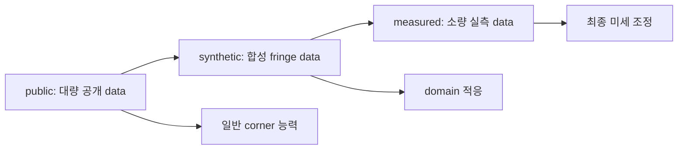

| 단계 | logical stage | 목적 |
| --- | --- | --- |
| 1 | `public` | 임의 사각형에서 corner 네 개를 찾는 일반 능력 학습 |
| 2 | `synthetic` | 검사 domain의 fringe texture 적응 |
| 3 | `measured` | 실측 소량 data로 최종 미세 조정 |

단계가 진행될수록 data 양과 learning rate가 함께 줄어든다. 현재 CLI의 `--dataset`은 이 단계 이름과
같으며 output path `outputs/<dataset>/<model>/<network_head>/<exp_name>/`의 첫 segment로 남는다.

## 페이지 5. Data 특성이 만드는 project 제약

각 단계의 data 특성은 project 설계 제약 F1부터 F8로 이어진다. 이 제약이 augmentation 범위, 표현 선택,
평가 기준을 결정한다.

| 제약 | 내용 | 주요 영향 |
| --- | --- | --- |
| F1 | 임의의 볼록 사각형, box 아님 | corner 표현 요구, box 근사 배제 |
| F2 | 단일 객체가 image 절반 이상 | 별도 검출 stage 불필요 |
| F3 | corner는 항상 경계 내부 | 회전 범위 제한과 clipping 검증 |
| F4 | measured 소량, synthetic 대량 | 3단계 전략과 합성 data 생성 근거 |
| F5 | subpixel 정밀도 | 좌표와 합성 자동 label로 양자화 오차 회피 |
| F7 | 조명과 texture 변동 | 광학 augmentation과 다중 위상 합성 |

synthetic 단계는 정규화 정사각형에 fringe pattern을 그린 뒤 homography로 원근 변환을 적용하므로,
corner label을 변환 parameter에서 오차 없이 자동으로 얻는다. 이는 subpixel 제약 F5와 부합한다. fringe의
시각적 특징은 phase measuring deflectometry 참고 자료의 반사면 관찰에 근거한다. data 전략의 상세는
[Data Strategy](../docs/architecture/05-data-strategy.md), 생성 절차와 파라미터는 [Synthetic Generation](../docs/guides/05-synthetic-generation.md)에서
다룬다.

## 페이지 6. Offline pre-augmentation과 online transform

synthetic과 measured image는 표본 수가 적어 학습 전에 offline pre-augmentation으로 표본 수를 미리
늘린다. 이는 dataloader가 학습 중 적용하는 단순 online transform과 목적과 강도가 다르다.

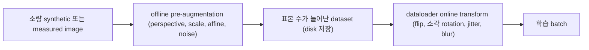

| 항목 | offline pre-augmentation | online transform |
| --- | --- | --- |
| 실행 시점 | 학습 전 1회 | 학습 중 매 epoch |
| 표본 수 | 실제로 증가 | 변하지 않음 |
| 저장 | 새 image와 label을 disk에 저장 | 저장하지 않고 batch 소비 |
| 변형 강도 | perspective, scale, affine, noise 강한 distortion | flip, 소각 rotation, 광학 jitter |

offline 확장에 사용하는 강한 distortion 계열 변형의 실제 결과는 다음과 같다. 합성 fringe panel에
`src/data/transforms.py`의 transform을 직접 적용한 결과이며 corner가 image와 함께 변환된다.

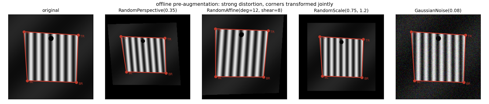

dataloader가 학습 중 적용하는 단순 online transform의 실제 결과는 다음과 같다. flip은 corner 순서를 다시
`TL`, `TR`, `BR`, `BL`로 재배정하고, rotation은 소각으로 제한되며, jitter와 blur는 좌표를 바꾸지 않는다.

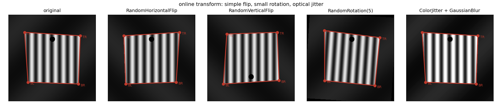

`src/data/transforms.py`의 `RandomPerspective`, `RandomScale`, `RandomAffine`, `GaussianNoise`는 image와
corner를 함께 변환하고 좌표가 `[0,1]`을 벗어나면 그 변형을 건너뛰는 distortion 계열로, offline 확장에
사용할 수 있다. 현재 active `get_transform`은 train split에 flip, 소각 rotation, jitter, blur만 online으로
적용하며 표본 수를 늘리지 않는다. offline pre-augmentation 자동화 script는 현재 공통 CLI 범위 밖이다.

## 페이지 7. synthetic 합성 변형 변수

offline pre-augmentation 이전에 synthetic 원본을 합성할 때부터 여러 변형 변수를 조합한다. 각 변수는
독립적으로 표본 수를 늘리는 축이며, 사용자는 필요에 따라 변수별 변형 개수를 차별 적용한다.

| 변수 계열 | 주요 옵션과 범위 | 예시 이미지 |
| --- | --- | --- |
| 위치와 자세 | rotation `$-10$`부터 `$+10$`도, 수평 이동 `$\pm 8\%$`, 수직 이동 `$\pm 2.5\%$`, top-bottom 비율 0.84부터 0.98의 trapezoid | `synth_position.png` |
| corner 라운딩 | 짧은 변 대비 반지름 3%부터 8%, 직사각형과 정사각형 panel | `synth_rounding.png` |
| 외부 지그 | 배치 left-right, top-bottom, four sides, 변당 개수 1부터 3, 길이 6%부터 20%, 깊이 3%부터 12%, 밝기 0.06부터 0.50 | `synth_holder.png` |
| 카메라 hole | 위치 top-center, upper-left, 지름 3%부터 6%, 가시성 visible, partial, hidden | `synth_camera_hole.png` |
| 배경 밝기 | 평균 0.03부터 0.90의 dark, medium, bright bin, 조명 gradient, vignetting 0%부터 25% | `synth_background.png` |
| fringe 왜곡 | 주파수 8부터 36 cycle, 위상 `$\{0, \pi/2, \pi, 3\pi/2\}$`, 방향 vertical과 horizontal, global bow deformation | `synth_fringe.png` |

각 변수 계열의 실제 합성 예시는 다음과 같다. 모든 예시에서 정답 corner 네 점이 함께 표시되며 합성
parameter에서 오차 없이 얻어진다.

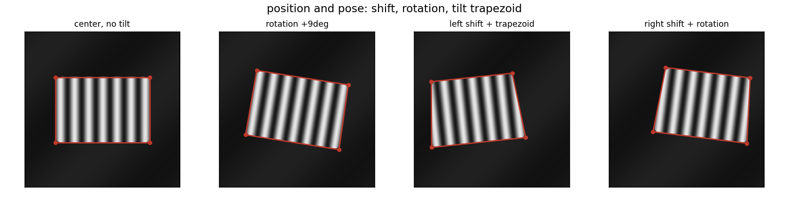

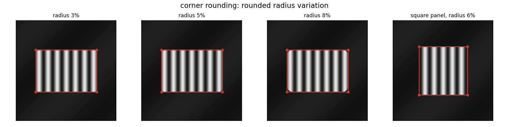

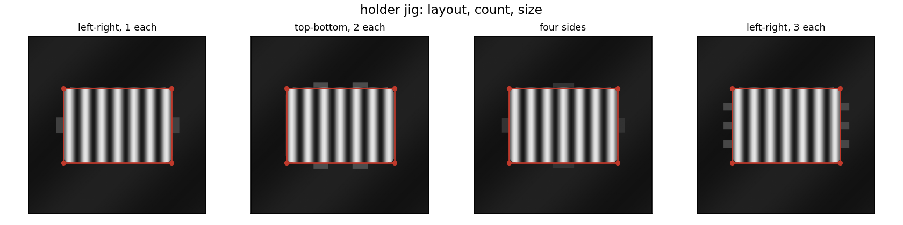

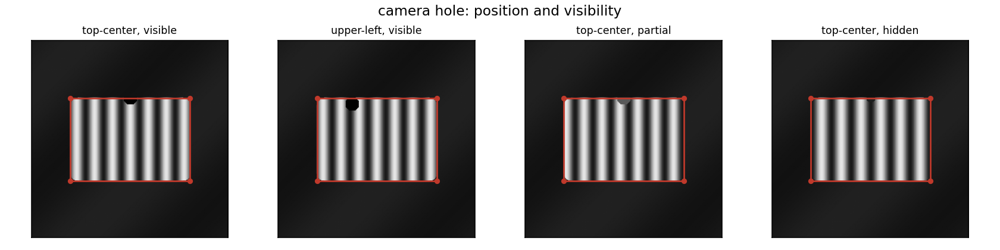

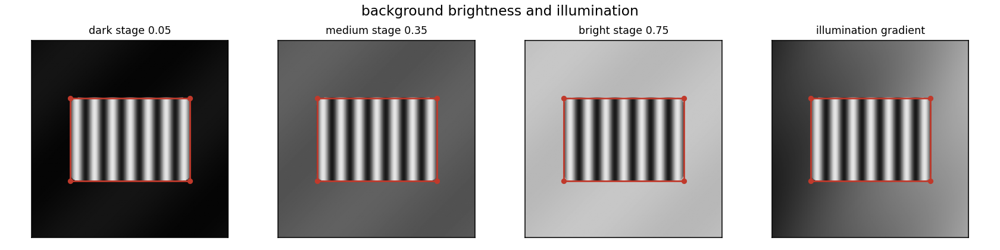

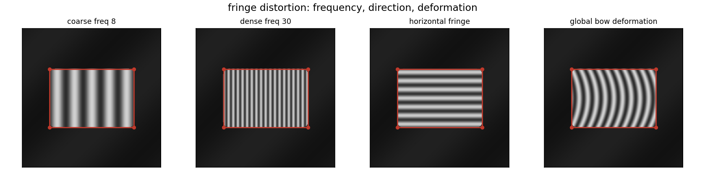

변수별 변형 개수를 차별 적용하는 방식은 domain 적응 목표에 맞춰 결정한다. measured data에서 자주
관찰되는 변형은 개수를 늘리고, 거의 나타나지 않는 변형은 줄여 표본 분포를 실측 분포에 가깝게 만든다.

## 페이지 8. synthetic 생성 파이프라인과 자동 레이블

합성은 정규화된 canonical OLED를 먼저 그린 뒤 homography로 원근에 투영하는 순서로 진행한다. corner
label은 이 투영 parameter에서 직접 얻으므로 사람이 클릭하지 않고 오차 없이 확보된다.

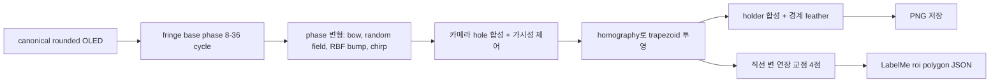

카메라 hole은 검출 대상이 아니라 어려운 외관 조건이며, fringe 위상을 재샘플링하여 세 가시성으로
제어한다.

| 가시성 | 목표 상태 | 제어 방법 |
| --- | --- | --- |
| visible | 밝은 fringe 중심의 선명한 검은 hole | hole 중심을 fringe 최대 밝기 근처에 두도록 위상 재샘플링 |
| partial | 명암 경계에 걸친 hole 일부 | hole 중심을 zero-crossing 근처에 배치 |
| hidden | 검은 fringe 중심의 낮은 대비 hole | hole 중심을 최소 밝기에 두고 지름을 dark band 이하로 제한 |

corner label은 rounded 모서리의 sharp pixel이 아니라 canonical OLED의 위, 오른쪽, 아래, 왼쪽 직선 변을
둥근 구간 너머로 연장한 네 교점이다. 이 네 점을 image와 동일한 homography로 변환해 LabelMe polygon에
`TL`, `TR`, `BR`, `BL` 순서로 기록한다. 생성과 gt_corners 변환 절차는
[Synthetic Generation](../docs/guides/05-synthetic-generation.md)에서 다룬다.

## 페이지 9. 공통 아이디어: corner contract

model마다 학습 중간 표현은 다르지만 최종 corner는 동일하다. 따라서 mask나 detection box를 학습하는
model도 같은 corner metric으로 비교할 수 있다.

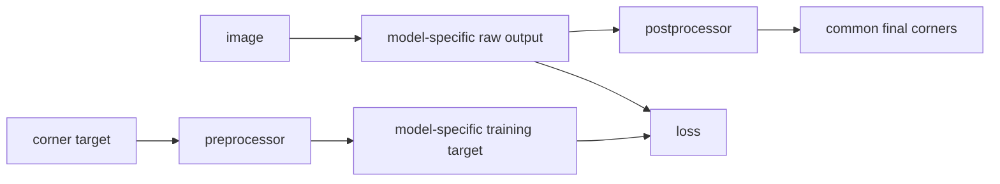

핵심 메시지는 표현이 달라도 평가 계약은 하나라는 점이다. 이 구조가 서로 다른 표현의 공정한 비교를
가능하게 한다.

## 페이지 10. 워크플로우 lifecycle

한 실험은 training, validation, evaluation, prediction 네 단계로 구성된다. validation은 training 안에서 매
epoch 실행되고 evaluation과 prediction은 checkpoint를 별도 script로 읽는다.

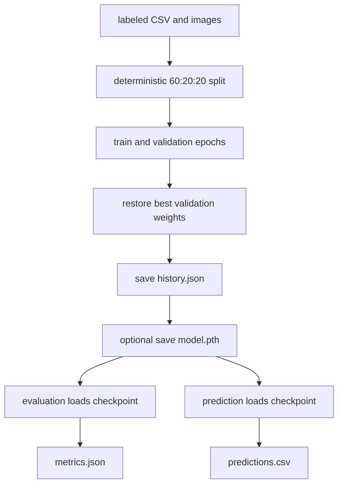

early stopping monitor는 validation IoU이고 checkpoint는 best validation epoch의 weight를 저장한다.

## 페이지 11. 조립 3축: model, network, head

세 단어는 모두 model 이름처럼 보이지만 서로 다른 선택 축이다.

| 축 | 선택 대상 | 예시 |
| --- | --- | --- |
| model | corner 표현과 loss package | `reg`, `seg`, `peak` |
| network | backbone 또는 complete architecture | `custom`, `resnet18`, `yolov8n` |
| head | model 안의 output variant | `gap`, `mask`, `box` |

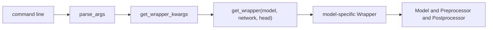

model을 바꿀 때는 compatible network와 head를 항상 함께 명시한다. checkpoint는 state dictionary만
저장하므로 load 시 동일한 세 축을 다시 지정해야 한다.

## 페이지 12. Model 표현 5계열

정답은 네 점뿐이지만 image가 제공하는 evidence는 점에만 있지 않다. 표현 계열은 다음과 같다.

| 표현 | 핵심 질문 | 해당 model |
| --- | --- | --- |
| coordinate | 좌표를 바로 예측할 수 있는가 | `reg` |
| mask | ROI 영역을 칠한 뒤 corner를 찾을 수 있는가 | `seg`, `hybrid`, `torchseg` |
| dense map | pixel이 corner나 edge에 가까운 정도를 예측할 수 있는가 | `peak`, `ridge` |
| detection | corner를 작은 object로 취급할 수 있는가 | `det`, `torchdet`, `yolo`, `detr` |
| refinement | 초기 polygon을 반복 보정할 수 있는가 | `gcn` |

표현이 복잡할수록 항상 성능이 좋아지는 것은 아니다. 계열마다 target 생성과 postprocess 비용이 다르다.

## 페이지 13. 지원 model 11종 개요

CLI의 `--model`이 선택하는 registry는 다음과 같다.

| model | 학습 표현 | 대표 head | raw output |
| --- | --- | --- | --- |
| `reg` | normalized corner 8개 회귀 | `gap`, `spatial` | `(B, 8)` logits |
| `seg` | ROI binary mask | `mask` | mask logits |
| `det` | class와 regression grid | `box`, `point` | class and box maps |
| `peak` | corner Gaussian peak map | `peak` | 4-channel logits |
| `ridge` | edge Gaussian ridge map | `ridge` | 4-channel logits |
| `gcn` | iterative corner refinement | `gcn` | refinement sequence |
| `hybrid` | learned mask와 classical geometry | `hybrid` | mask logits |
| `torchseg` | torchvision segmentation mask | `mask` | torchvision mask logits |
| `torchdet` | torchvision detection | `box`, `point` | torchvision detections |
| `yolo` | Ultralytics detection | `box`, `point` | Ultralytics detections |
| `detr` | Hugging Face DETR detection | `box`, `point` | DETR output |

앞의 7개는 project component를 조립하는 composable model이고 뒤의 4개는 external whole-model이다.

## 페이지 14. reg (Direct Coordinate Regression)

image feature를 하나의 표현으로 압축한 뒤 네 corner 좌표 8개를 직접 회귀한다. 가장 단순한 baseline이다.

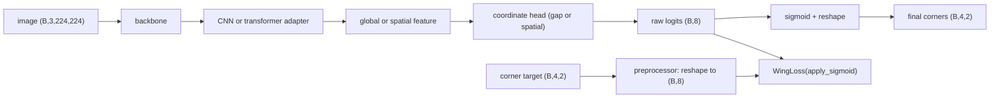

후처리 결과 예시는 다음과 같다. `reg`는 head가 `gap`과 `spatial` 두 종류이므로 각 head의 후처리
결과를 함께 보인다. 두 head 모두 후처리 자체는 sigmoid와 reshape로 동일하지만, head가 feature를
소비하는 방식이 달라 예상 오차 패턴이 다르다.

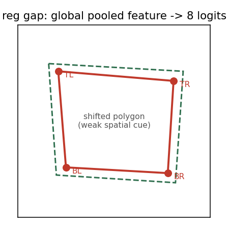

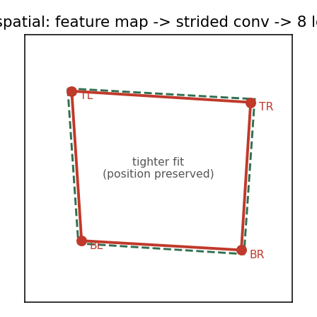

| 요소 | 내용 |
| --- | --- |
| 전처리 | `(B,4,2)`를 `(B,8)`로 reshape, 값 변형 없음 |
| 후처리 | sigmoid 후 `(B,4,2)` reshape, threshold나 NMS 없음 |
| 손실함수 | `WingLoss(apply_sigmoid=True)`, `w=10`, `epsilon=2` |
| `gap` head | global average pooling 또는 class token을 하나의 linear로 회귀, 계산이 적으나 spatial 정보 손실 |
| `spatial` head | feature map을 strided conv로 축소한 뒤 회귀, 위치 정보 보존, parameter 증가 |
| 특징 | 항상 네 점 반환, geometric constraint 없음, ordering 오류 주의 |

## 페이지 15. seg (Binary ROI Segmentation)

좌표 대신 ROI 영역을 먼저 칠하고 mask 외곽의 극점에서 corner를 복원한다.

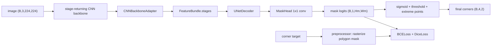

후처리 결과 예시는 다음과 같다.

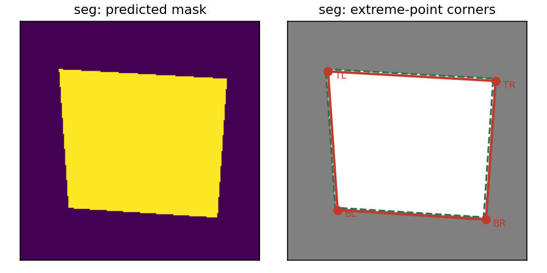

| 요소 | 내용 |
| --- | --- |
| 전처리 | 네 corner를 채운 binary mask target 생성 |
| 후처리 | sigmoid, threshold, 네 방향 극점 선택 |
| 손실함수 | `BCELoss`와 `DiceLoss`를 각각 weight 1로 합산 |
| 특징 | area supervision 사용, mask loss 감소가 corner IoU와 항상 일치하지 않음 |

## 페이지 16. peak (Dense Corner Heatmap)

각 corner 주변에 Gaussian 봉우리를 만들고 channel별 hard argmax로 점을 복원한다.

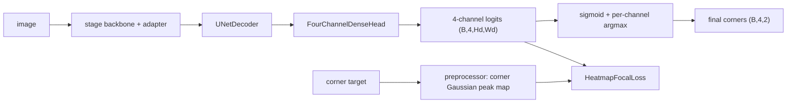

후처리 결과 예시는 다음과 같다.

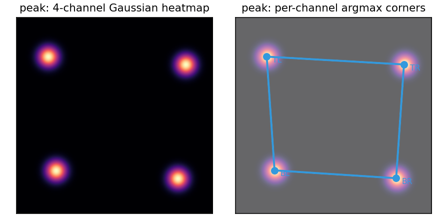

| 요소 | 내용 |
| --- | --- |
| 전처리 | corner-centered 2D Gaussian, 기본 sigma 2.0, channel별 max 정규화 |
| 후처리 | channel argmax, subpixel interpolation 없음 |
| 손실함수 | `HeatmapFocalLoss`, `alpha=2`, `beta=4` |
| 특징 | corner당 positive cell 하나, cell 단위 quantization 존재 |

## 페이지 17. ridge (Dense Edge Ridge)

polygon의 각 변을 Gaussian 능선으로 표현하고 PCA line fitting과 인접 line intersection으로 corner를
복원한다.

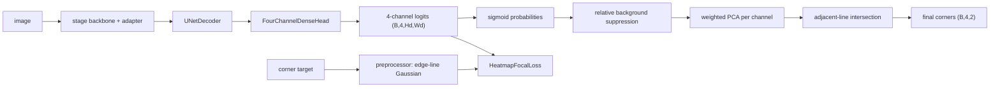

후처리 결과 예시는 다음과 같다.

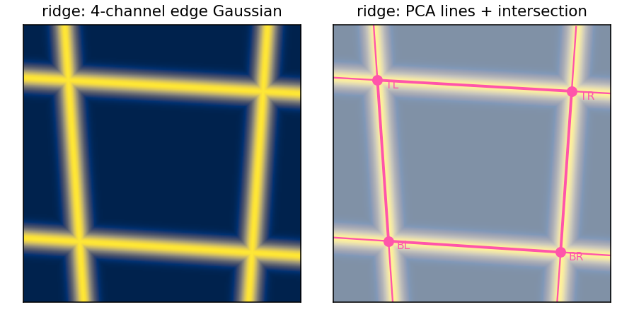

| 요소 | 내용 |
| --- | --- |
| 전처리 | infinite-line distance Gaussian, sigma는 `ridge_size / 28` |
| 후처리 | background suppression, weighted PCA, line intersection |
| 손실함수 | `HeatmapFocalLoss`, exact positive가 없을 수 있음 |
| 특징 | edge 전체 evidence 사용, 인접 line이 평행하면 corner가 크게 이탈 가능 |

## 페이지 18. det (Custom Grid Detection)

corner를 class가 있는 작은 object로 보고 grid cell에서 class와 offset을 학습한다.

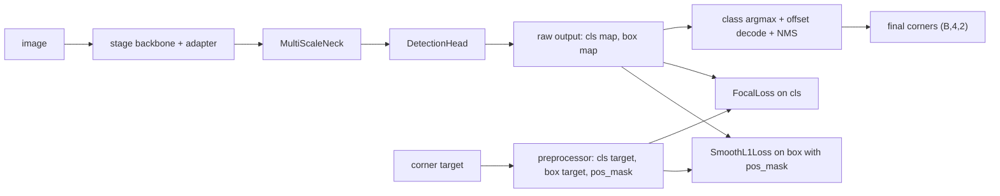

후처리 결과 예시는 다음과 같다. `det`는 head가 `box`와 `point` 두 종류이므로 각 head의 후처리
결과를 함께 보인다. 두 head 모두 class 선택과 offset decode로 box center를 corner로 사용하는 점은
같고, `box` head만 고정 pseudo width와 height를 추가로 회귀한다.

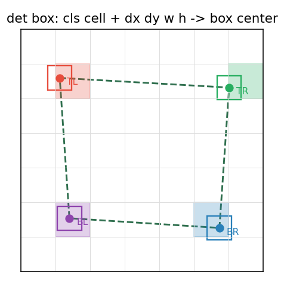

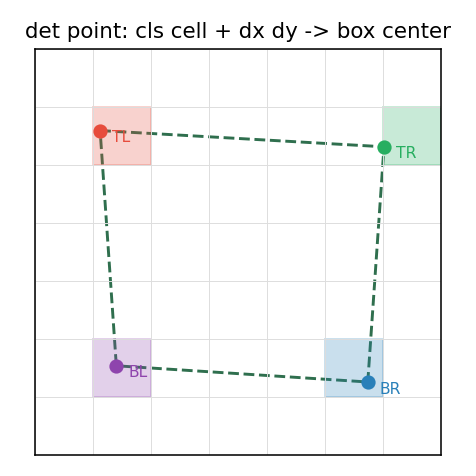

| 요소 | 내용 |
| --- | --- |
| 전처리 | class별 positive cell, `dx dy w h` 또는 `dx dy` regression target, positive mask |
| 후처리 | class 선택, offset decode, box center를 corner로 사용 |
| 손실함수 | `FocalLoss(cls)`와 `SmoothL1Loss(box)`, positive cell만 regression |
| `box` head | regression 4채널 `dx dy w h`, 고정 pseudo box size 회귀 포함 |
| `point` head | regression 2채널 `dx dy`, pseudo width와 height 회귀 없음 |
| 특징 | class 분리로 ordering 자동 해결, ViT token-only backbone은 거부 |

## 페이지 19. gcn (Iterative Graph Refinement)

초기 corner를 만든 뒤 네 vertex의 관계를 message passing으로 반복 보정한다.

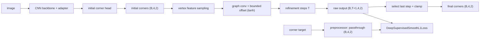

후처리 결과 예시는 다음과 같다.

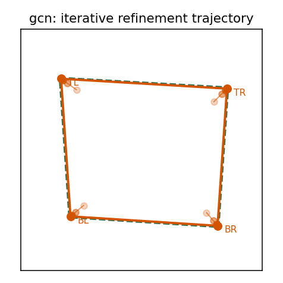

| 요소 | 내용 |
| --- | --- |
| 전처리 | target을 그대로 전달, loss가 모든 step으로 확장 |
| 후처리 | 마지막 step 선택 후 `[0,1]` clamp |
| 손실함수 | `DeepSupervisedSmoothL1Loss`, 모든 step 같은 target과 비교 |
| 특징 | corner 관계를 명시적으로 사용, corner 순서가 vertex identity |

## 페이지 20. hybrid (Learned Mask + Classical Geometry)

network는 mask만 학습하고 OpenCV 기반 geometry postprocessor가 corner를 복원한다.

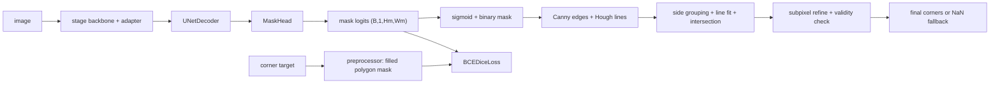

후처리 결과 예시는 다음과 같다.

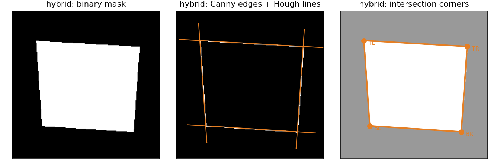

| 요소 | 내용 |
| --- | --- |
| 전처리 | `SegPreprocessor` 상속, filled polygon mask target |
| 후처리 | Canny, Hough, side grouping, intersection, subpixel, fallback |
| 손실함수 | `BCEDiceLoss` 단일 object |
| 특징 | geometry가 loss에 참여하지 않음, final output이 NaN일 수 있음 |

## 페이지 21. 외부 whole-model 래퍼

`torchseg`, `torchdet`, `yolo`, `detr`은 library 내부 encoder-decoder-head 결합을 유지하고 입출력
interface만 corner contract로 바꾼다.

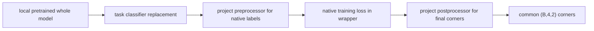

| model | native loss | 변환 지점 |
| --- | --- | --- |
| `torchseg` | `BCELoss`, `DiceLoss` | project decoder 대신 torchvision FCN whole model |
| `torchdet` | torchvision native loss dict | pseudo-box target, detection to corner |
| `yolo` | Ultralytics `box`, `cls`, `dfl` | 4-class classifier, point-size pseudo-box, NMS |
| `detr` | Hugging Face Hungarian loss | DETR output을 corner로 decode, grad norm clip |

이 계열은 `FeatureBundle`을 사용하지 않고 wrapper가 native interface를 common trainer step으로 감싼다.

## 페이지 22. 평가 지표

standalone evaluator는 모든 model을 같은 corner로 바꾼 뒤 여섯 지표를 계산한다.

| key | 의미 | 좋은 방향 |
| --- | --- | --- |
| `iou` | predicted와 target polygon area IoU | 높을수록 좋음 |
| `mcd` | 네 corner distance의 sample 평균 | 낮을수록 좋음 |
| `maxcd` | sample별 worst corner distance의 평균 | 낮을수록 좋음 |
| `pck_002` | distance 0.02 이내 corner 비율 | 높을수록 좋음 |
| `pck_005` | distance 0.05 이내 corner 비율 | 높을수록 좋음 |
| `sr` | 모든 coordinate가 finite인 sample 비율 | 높을수록 좋음 |

`sr`이 1이어도 정확한 것은 아니다. zero나 center fallback도 finite이므로 `iou`, `maxcd`와 함께 읽는다.

## 페이지 23. 학습과 평가 결과 비교 (프레임)

동일한 CSV, seed, image size, test split을 고정하고 model과 network 축을 한 번에 하나씩 바꿔 비교한다.
다음 표는 값을 채우기 전 비교 프레임이다.

| model | network | head | IoU | MCD | MaxCD | PCK 0.02 | PCK 0.05 | SR |
| --- | --- | --- | ---: | ---: | ---: | ---: | ---: | ---: |
| `reg` | `custom` | `gap` |  |  |  |  |  |  |
| `seg` | `resnet18` | `mask` |  |  |  |  |  |  |
| `peak` | `custom` | `peak` |  |  |  |  |  |  |
| `ridge` | `custom` | `ridge` |  |  |  |  |  |  |
| `det` | `custom` | `box` |  |  |  |  |  |  |
| `gcn` | `custom` | `gcn` |  |  |  |  |  |  |
| `hybrid` | `custom` | `hybrid` |  |  |  |  |  |  |
| `torchseg` | `fcn_resnet50` | `mask` |  |  |  |  |  |  |
| `yolo` | `yolov8n` | `box` |  |  |  |  |  |  |

현재 `outputs/`에는 gcn과 hybrid의 짧은 smoke run history만 있고 `metrics.json`이 없으므로 이 표의 값은
전체 벤치마크 실행 후 채운다.

## 페이지 24. 최적 model 선정 기준

두 model을 비교할 때는 다음 순서로 판단한다.

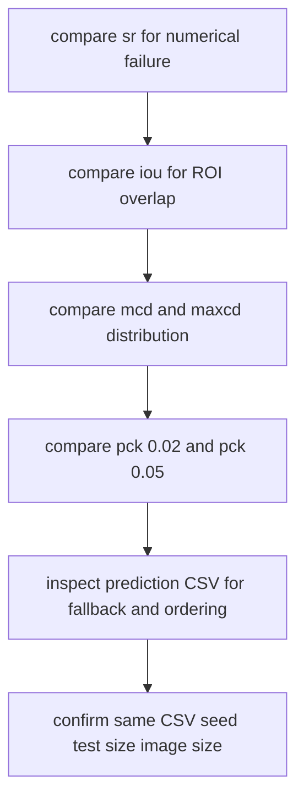

training loss는 표현마다 scale이 달라 비교 표에 넣지 않는다. 표현 복잡도가 곧 성능은 아니므로 동일한
조건에서의 metric과 실패 sample을 함께 본다.

## 페이지 25. 현재 상태와 다음 단계

현재 상태는 다음과 같다.

- root README와 `docs/` canonical 문서 baseline 완료
- 11개 model registry와 CLI 조립 축 확립
- 후처리 시각화 도식 자산 생성
- 전체 model 조합 벤치마크 결과는 미실행, smoke run history만 존재

다음 단계는 다음과 같다.

- 동일 조건으로 전체 model 조합 evaluation 실행 후 `metrics.json` 수집
- 페이지 22 비교 표와 후처리 이미지를 실제 예측 결과로 교체
- 선정된 상위 model에 대한 network와 head ablation
- markdown 초안을 pptx로 변환

현재 제약은 image size 224 고정 권장, checkpoint가 state dictionary만 저장, seed가 bit-level 재현을
보장하지 않는 점이다.
</content>
